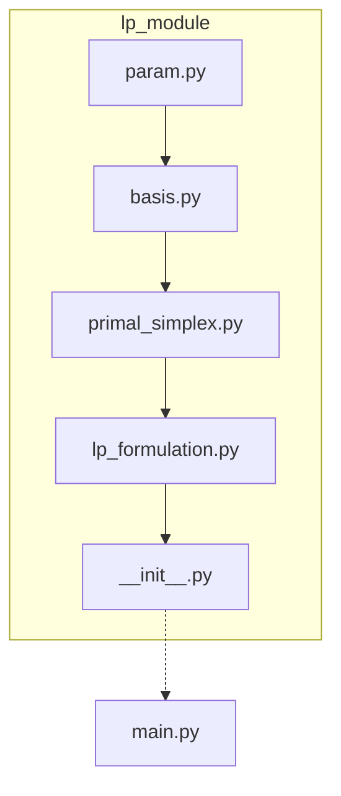

# [ON-GOING] Linear Programming Solver

## Code Architecture

```mermaid
graph TD; 
  subgraph "lp_module"
    P[param.py] --> B[basis.py]
    B --> S[primal_simplex.py]
    S --> F[lp_formulation.py]
    F --> I[__init__.py]
  end
  I -.-> M[main.py]
```
