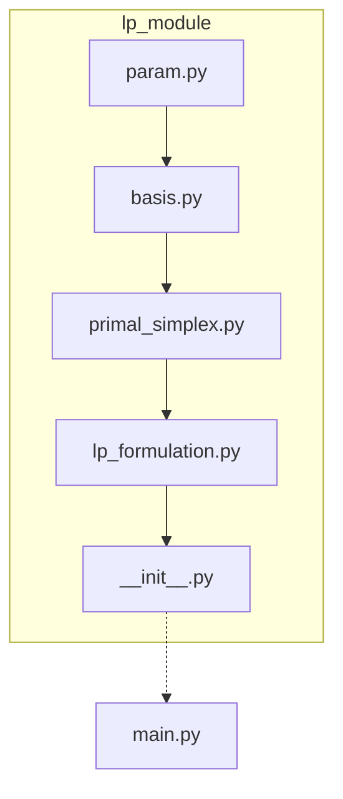

# [ON-GOING] Linear Programming Solver

## Code Architecture

## References

LP instances were found on [John Burkardt](https://www.researchgate.net/profile/John-Burkardt) educational page via [this link](https://people.sc.fsu.edu/~jburkardt/datasets/mps/).