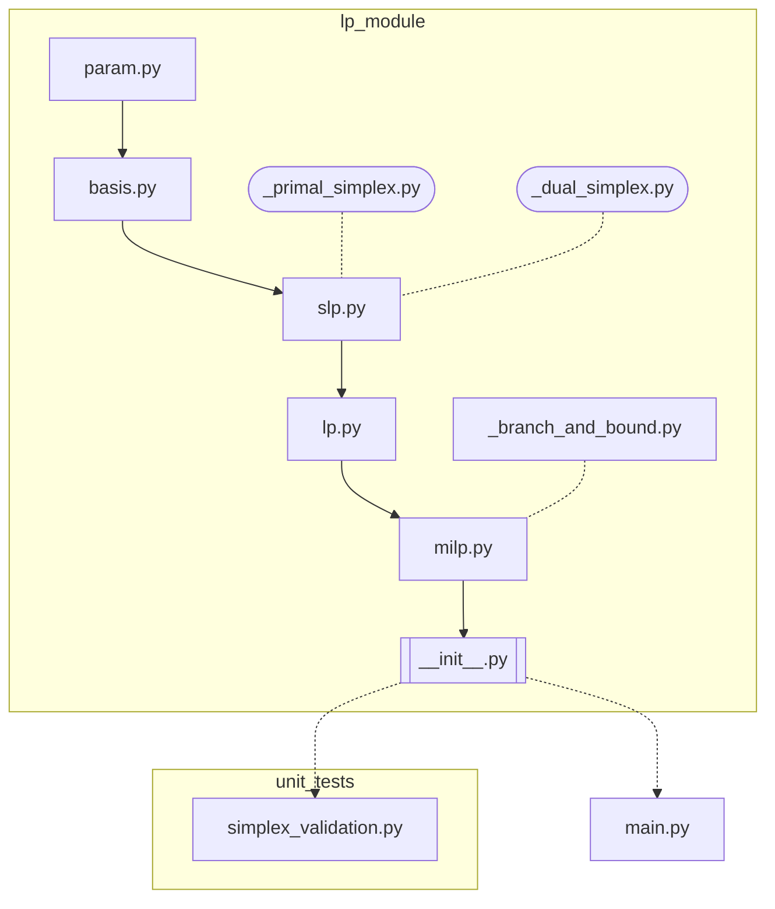

# [ON-GOING] Linear Programming Solver

## Code Architecture


```mermaid
graph TD; 
  subgraph "lp_module"
    P[param.py] --> B[basis.py]
    PS([_primal_simplex.py])
    DS([_dual_simplex.py])
    B --> S[slp.py]
    PS -.- S
    DS -.- S
    S --> F[lp.py]
    F --> MILP[milp.py]
    BB[_branch_and_bound.py] -.- MILP
    MILP --> I[[__init__.py]]
    
  end
  I -.-> M[main.py]
  subgraph "unit_tests"
    V[simplex_validation.py]
  end
  I -.-> V
```


## Hypotheses 
- Continuous variables must be lower bounded.
- Discrete variables must be lower and upper bounded.

## Usage : example of a knapsack problem

We show here how to solve a basic MILP problem with our module. The following knaspack example will be taken as example. 
 


### Problem definition

- **0) Loading module and creating a MILP instance**
```python
from milp_module import *
import numpy as np
milp = MILP_Problem() # creation of a MILP instance
```

- **1) Defining the objective**:
```python
c = np.array([8., 11., 6., 4.]) # objective coefficients
milp.set_objective("Max",c) # only "Min" or "Max" are allowed
```
- **2) Defining bounds and integer conditions of the variables**:
```python
x_l = np.array([0., 0., 0., 0.])
x_u = np.array([1., 1., 1., 1.])
int_vars = np.array([True, True, True, True])
milp.set_variable_bounds(x_l,x_u,int_vars)
```
- **3) Defining constraints**

\[Note\]: the method `set_constraints` remove the potential old constraints stored in the `MILP_Problem` instance.
```python
a1 = np.array([5., 7., 4., 3.])
b1_l = -np.inf
b1_u = 14.
cstr1 = Constraint(a1,"<=",b1_l,b1_u)
milp.set_constraints([cstr1])
```

### Solving the problem
You may choose the level of logging you want with the parameter `verbosity`. The default value `-1` prints nothing. You can choose the safety for the maximum number of nodes (sub problems) computed with the parameter `max_nb_nodes`. Various tolerance parameters relative to digital approximation of zero in the Branch & Bound and simplex methods can be set in the [*milp_module/param.py*](milp_module/param.py) file.
```python
x_opti, z_opti = ks.solve(verbosity=0)
```
Once you have run all the lines above, you will get the following result:

```terminal
Max  8.0•X_0 + 11.0•X_1 + 6.0•X_2 + 4.0•X_3
subject to :
 ⦿ -inf <=  5.0•X_0 + 7.0•X_1 + 4.0•X_2 + 3.0•X_3 <= 14.0
 ⦿ X_0 ∈ [0.0, 1.0]
 ⦿ X_1 ∈ [0.0, 1.0]
 ⦿ X_2 ∈ [0.0, 1.0]
 ⦿ X_3 ∈ [0.0, 1.0]

MILS successfully solved with B&B : 	 • z = 20.999999988279633
	 • x = [0. 1. 1. 1.]
```


## References

LP instances were found in the [Netlib dataset](https://www.netlib.org/lp/data/). The files were decompressed thanks to the `emps.c` tool, also found on this page.
