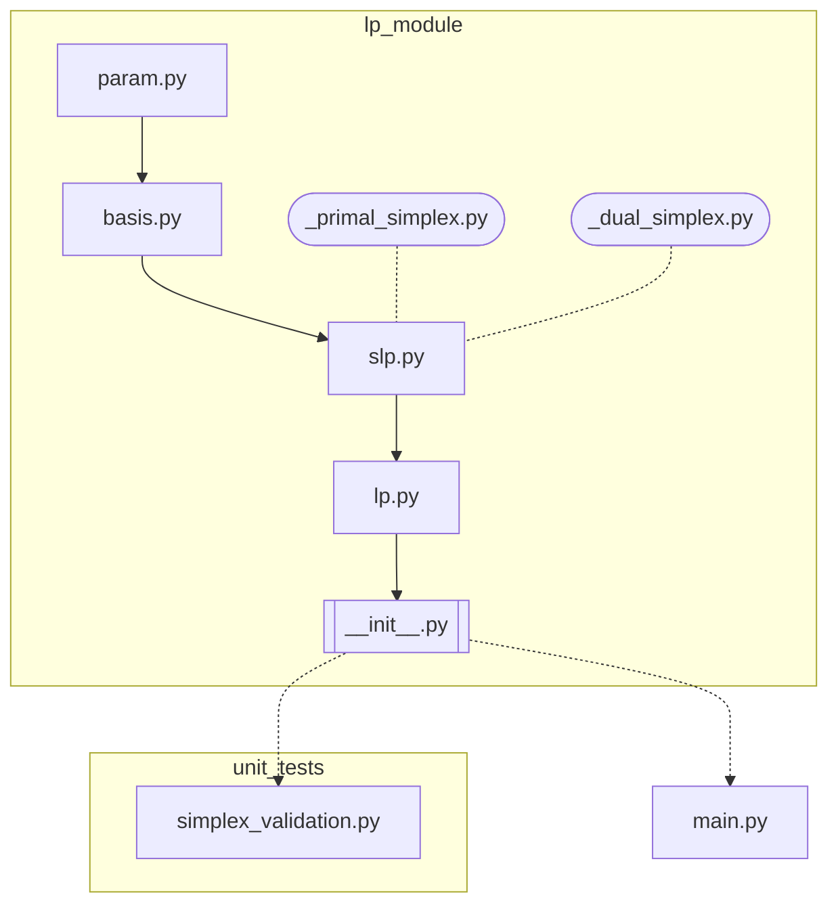

# [ON-GOING] Linear Programming Solver

## Code Architecture

```mermaid
graph TD; 
  subgraph "lp_module"
    P[param.py] --> B[basis.py]
    PS([_primal_simplex.py])
    DS([_dual_simplex.py])
    B --> S[slp.py]
    PS -.- S
    DS -.- S
    S --> F[lp.py]
    F --> I[[__init__.py]]
  end
  I -.-> M[main.py]
  subgraph "unit_tests"
    V[simplex_validation.py]
  end
  I -.-> V
```

## References

LP instances were found in the [Netlib dataset](https://www.netlib.org/lp/data/). The files were decompressed thanks to the `emps.c` tool, also found on this page.
