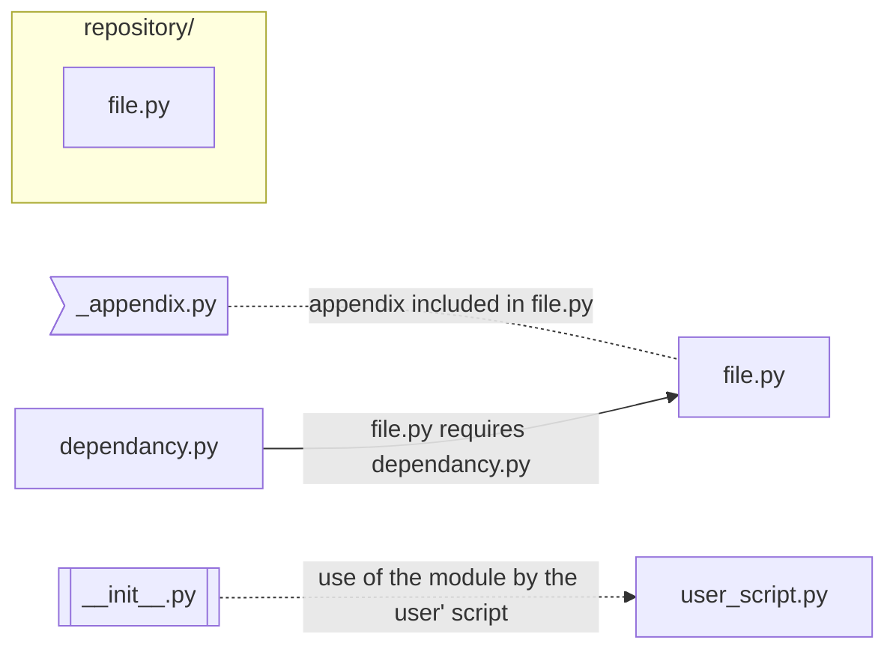
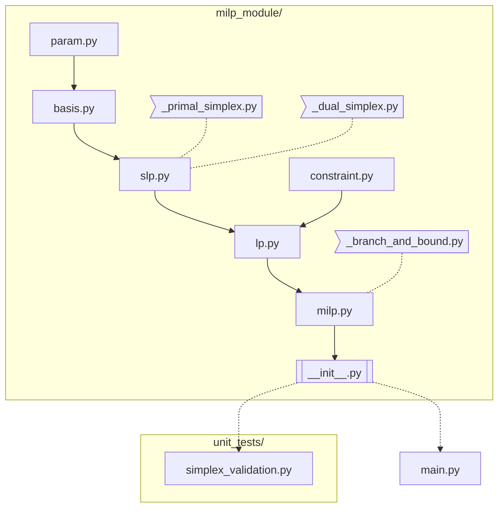
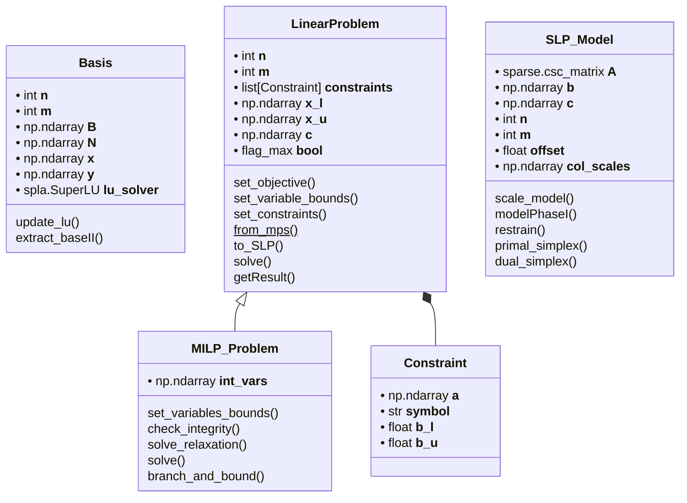

# Mixed Integer-Linear Programming (MILP) Solver

## Summary

1. [Introduction](README#Introduction)
2. [Usage](<README#Usage example of a knapsack problem>)
3. [Code Architecture](<README#Code Architecture>)

## Introduction

This project took place before my final-year internship. The aim was to build an Mixed Integer Linear Programming (MILP) solver from scratch so that I could fully understand the underlying principles of the methods used in commercial solvers (HiGHS, Gurobi, CPLEX, etc.).

I chose to implement this module in Python to improve my knowledge of the language. Above all, I learnt how to build a module and how to use object-oriented programming, something I’d already done a lot in C++ and Julia, but never in Python.

### Requirements

Here are the packages I used in my MILP solver that are not included in Python by default:
- **highspy** (to read MPS files)
- **numpy**
- **scipy.sparse** (to get faster LU linear resolutions)

I used Python 1.13. You can install the required package with the following command:
```bash
pip install highspy numpy scipy
```

### References

LP instances were found in the [Netlib dataset](https://www.netlib.org/lp/data/). The files were decompressed with the `emps.c` tool, also found on this page.

## Usage example of a knapsack problem

We show here how to solve a basic MILP problem with our module. The following knaspack example will be taken as example. 
```math
\begin{align}
\max \hspace{0.5cm}& 8x_1 + 11x_2 + 6x_3 + 4x_4 \\
\text{s.t.   }\hspace{0.5cm} & 5x_1 + 7x_2 + 4x_3 + 3x_4 \leq 14 \\
& x_1,x_2,x_3,x_4 \in \{0,1\}
\end{align}
```


### Problem definition

- __0) Loading module and creating a MILP instance__
```python
from milp_module import *
import numpy as np
milp = MILP_Problem() # creation of a MILP instance
```

- __1) Defining the objective__:
```python
c = np.array([8., 11., 6., 4.]) # objective coefficients
milp.set_objective("Max",c) # only "Min" or "Max" are allowed
```
- __2) Defining bounds and integer conditions of the variables__:

\[Note\]: The variables must be lower-bounder (`-np.inf` values are not permitted in `x_l` array).
```python
x_l = np.array([0., 0., 0., 0.])
x_u = np.array([1., 1., 1., 1.])
int_vars = np.array([True, True, True, True])
milp.set_variable_bounds(x_l,x_u,int_vars)
```
- __3) Defining constraints__

\[Note\]: the method `set_constraints` remove the potential old constraints stored in the `MILP_Problem` instance.
```python
a1 = np.array([5., 7., 4., 3.])
b1_l = -np.inf
b1_u = 14.
cstr1 = Constraint(a1,"<=",b1_l,b1_u)
milp.set_constraints([cstr1])
```

### Solving the problem
You may choose the level of logging you want with the parameter `verbosity`. The default value `-1` prints nothing. You can choose the safety for the maximum number of nodes (sub problems) computed with the parameter `max_nb_nodes`. Various tolerance parameters relative to digital approximation of zero in the Branch & Bound and simplex methods can be set in the [*milp_module/param.py*](milp_module/param.py) file.
```python
x_opti, z_opti = ks.solve(verbosity=0)
```
Once you have run all the lines above, you will get the following result:

```terminal
Max  8.0•X_0 + 11.0•X_1 + 6.0•X_2 + 4.0•X_3
subject to :
 ⦿ -inf <=  5.0•X_0 + 7.0•X_1 + 4.0•X_2 + 3.0•X_3 <= 14.0
 ⦿ X_0 ∈ [0.0, 1.0]
 ⦿ X_1 ∈ [0.0, 1.0]
 ⦿ X_2 ∈ [0.0, 1.0]
 ⦿ X_3 ∈ [0.0, 1.0]

MILP successfully solved with B&B : z = 21.0
	 • x = [0. 1. 1. 1.]
```


## Code Architecture

### Files hierarchy

- **Legend**

```mermaid
graph LR;
  subgraph repository ["repository/"]
    F[file.py];
  end
  
  A>_appendix.py] -. "appendix included in file.py" .- B[file.py]
  D[dependancy.py] -- "file.py requires dependancy.py" --> B
  I[[__init__.py]] -. "use of the module by the user' script" .-> U[user_script.py]
```

- **Hierarchy**

```mermaid
---
config:
  htmlLabels: false
---
graph TD; 
  subgraph milp_module/
    P[param.py] --> B[basis.py]
    PS>_primal_simplex.py]
    DS>_dual_simplex.py]
    B --> S[slp.py]
    PS -.- S
    DS -.- S
    S --> F[lp.py]
    C[constraint.py] -->F
    F --> MILP[milp.py]
    BB>_branch_and_bound.py] -.- MILP
    MILP --> I[[__init__.py]]
    
  end
  I -.-> M[main.py]
  subgraph unit_tests/
    V[simplex_validation.py]
  end
  I -.-> V
```

- **Description**

|File name | Description | Key functions provided|
|-----|-------------|-------------------|
| [`basis.py`](milp_module/basis.py) | Definition of the `Basis` class, its attributes and methods.  | `update_lu()`, `extract_baseII()`|
| [`constraint.py`](milp_module/constraint.py) | Definition of the `Constraint` class, its attributes and methods. |  | 
| [`milp.py`](milp_module/milp.py) | Definition of the `MILP_Problem` class, its attributes and methods (solver) that are not inherited from the `LinearProblem` class. | `check_integrity()`, `solve_relaxation()`, `solve()`|
| [`lp.py`](milp_module/lp.py) | Definition of the `LinearProblem` class, its attributes and methods (including manual LP construction, MPS reader and solver).  | `from_mps()`, `to_SLP()`, `solve()` |
| [`param.py`](milp_module/param.py) | List of all constants used to approximate the digital zero in various limit cases | |
| [`slp.py`](milp_module/slp.py) | Definition of the `SLP_Model` class, its attributes and methods. | `scale_model()`, `modelPhaseI()`, `restrain()`
| [`_branch_and_bound.py`](milp_module/_branch_and_bound.py) | Implementation of the branch and band (B&B) algorithm that is included in `MILP_Problem` class for its resolution. | `branch_and_bound()` | 
| [`_dual_simplex.py`](milp_module/_dual_simplex.py) | Implementation of the dual simplex algorithm that is included in `LinearProblem` to solve restrained LP problems. | `dual_simplex()` | 
| [`_primal_simplex.py`](milp_module/_primal_simplex.py) | Implementation of the primal simplex algorithm that is included in `LinearProblem` to solve initial LP problems. | `dual_simplex()` | 
| [`__init__.py`](milp_module/__init__.py) | Module interface to allow users to access to some classes and their methods | `Constraint`, `LinearProblem`, `MILP_Problem`, `TOL_Z` |


### Class diagram

\[Note \]: In Python there are no really private attributes (Some variables can be seen as ``protected" if the begin with an underscore `_`, but it is just a writting convention). This is why in the following UML diagram, I didn't specify whether an attribute or a method is private (`-`) or public (`+`).


```mermaid
---
config:
  htmlLabels: false
---
classDiagram
    class Basis{
        • int __n__
        • int __m__
        • np.ndarray __B__
        • np.ndarray __N__
        • np.ndarray __x__
        • np.ndarray __y__
        • spla.SuperLU __lu_solver__
        
        update_lu()
        extract_baseII()
    }
    class Constraint{
        • np.ndarray __a__
        • str __symbol__
        • float __b_l__
        • float __b_u__
    }
    
    class LinearProblem{
        • int __n__
        • int __m__ 
        • list[Constraint] __constraints__
        • np.ndarray __x_l__
        • np.ndarray __x_u__
        • np.ndarray __c__
        • flag_max __bool__
        
        set_objective()
        set_variable_bounds()
        set_constraints()
        from_mps()$
        to_SLP()
        solve()
        getResult()
    }
    
    class MILP_Problem{
        • np.ndarray __int_vars__
        set_variables_bounds()
        check_integrity()
        solve_relaxation()
        solve()
        branch_and_bound()
    }
    
    class SLP_Model{
        • sparse.csc_matrix __A__
        • np.ndarray __b__
        • np.ndarray __c__
        • int __n__
        • int __m__
        • float __offset__
        • np.ndarray __col_scales__
        scale_model()
        modelPhaseI()
        restrain()
        primal_simplex()
        dual_simplex()

    }
    
    LinearProblem <|-- MILP_Problem
    LinearProblem *-- Constraint
    
```
